<div align="center">

<!-- Animated Header -->


</div>

# Hi there! 👋 Welcome to my Digital Space

<div align="center">
  
### 🚀 Aspiring Software Developer | Android Enthusiast | AI Explorer
  
*Building the future, one app at a time*

[](https://linkedin.com/in/sagarikaaa)
[](mailto:barmansagarika303@gmail.com)
[](https://github.com/barmansagarika)

</div>

---

## 🌟 About Me

```kotlin
class SagarikaBarman : Developer() {
    val name = "Sagarika Barman"
    val location = "Guwahati, India"
    val currentFocus = listOf("Android Development", "Generative AI", "Open Source")
    val education = "B.Tech CSE @ KIIT (2022-2026)"
    
    fun getCurrentStatus(): String {
        return "Building innovative Android apps with Kotlin & Jetpack Compose 📱"
    }
    
    fun getPassion(): List<String> {
        return listOf(
            "Collaborative Projects 🤝",
            "User Experience Optimization ✨",
            "Terminal Automation Systems 🏭",
            "Real-time Applications 🔄"
        )
    }
}
```

---

## 💻 Tech Arsenal

<div align="center">

### 🏗️ Languages & Frameworks


### 🛠️ Tools & Technologies


</div>

---

## 🚀 Featured Projects

<div align="center">

### 📱 Kaiwa Video Calling App
*Real-time communication redefined*

🔧 **Tech Stack:** Kotlin • Jetpack Compose • Agora SDK • MVVM • Coroutines  
✨ **Highlights:** Real-time video calls, seamless UX, performance optimization  
🎯 **Architecture:** MVVM with efficient asynchronous operations

---

### 🌤️ Weather App
*Your personal weather companion*

🔧 **Tech Stack:** HTML • CSS • JavaScript • OpenWeather API  
✨ **Highlights:** Real-time weather data, intuitive UI, responsive design  
🎯 **Features:** Error handling, optimized API calls, fast loading

</div>

---

## 💼 Professional Journey

<table>
<tr>
<td width="50%">

### 🏭 BPCL Summer Intern
**Terminal Automation System (TAS)**
- Enhanced safety measures & system performance
- Collaborated with cross-functional teams
- Tested automation software for compliance
- Prepared detailed performance reports

</td>
<td width="50%">

### 👨‍💻 GDG KIIT Android Developer
**Community & Learning**
- Promoted Google technologies
- Attended Study Jams on Generative AI
- Enhanced modern development practices
- Active community participation

</td>
</tr>
</table>

---

## 🏆 Achievements & Certifications

<div align="center">

🎖️ **Introduction to Responsible AI** - *Google Cloud Skills Boost (May 2024)*  
🎖️ **Android Programming for Beginners** - *Coursera (July 2023)*  
🎯 **B.Tech CSE** - *KIIT University (2022-2026)*

</div>

---

## 📊 GitHub Analytics

<div align="center">


</div>

---

## 🎯 Current Focus

```mermaid
graph LR
    A[🎓 Learning] --> B[Generative AI]
    A --> C[Advanced Android]
    A --> D[Open Source]
    
    E[🏗️ Building] --> F[Innovative Apps]
    E --> G[User-Centric Solutions]
    E --> H[Collaborative Projects]
    
    I[🌱 Growing] --> J[Community Involvement]
    I --> K[Technical Leadership]
    I --> L[Industry Knowledge]
```



---

## 🤝 Let's Connect & Collaborate!

<div align="center">

*"The best way to predict the future is to create it together."*

I'm always excited to collaborate on innovative projects, especially in:
- 📱 Android Development
- 🤖 AI/ML Applications  
- 🔗 Real-time Systems
- 🌐 Open Source Contributions

**Reach out if you're interested in building something amazing together!**

[](https://github.com/barmansagarika)

</div>

---

<div align="center">

### 💡 Fun Fact
*I believe great software is born from great collaboration - let's build the future together!* 🚀

<!-- Animated Footer -->


</div>
